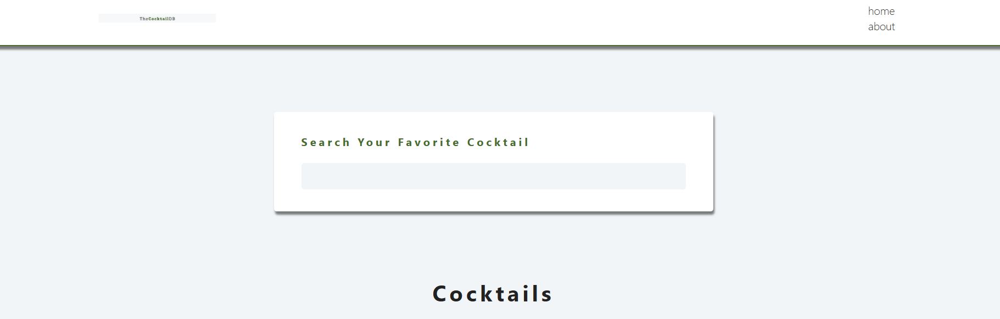
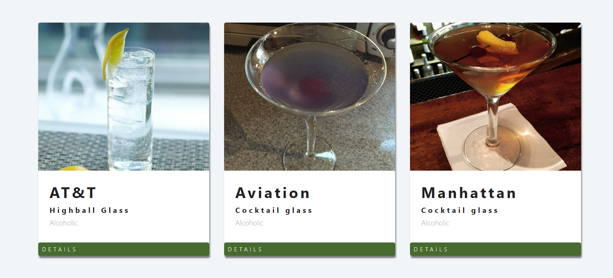

# Cocktail project

this project composed of components and pages

i use react route to route between home and about pages

it also use context provider 

it use side effect to fecth the url

# final page looks like

# Bisrat 

